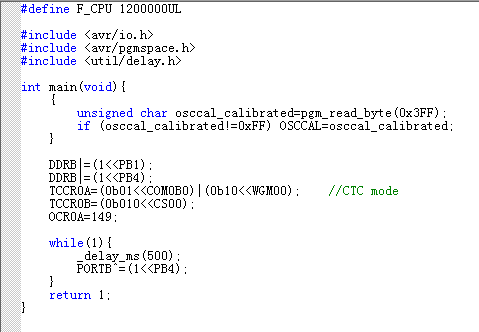
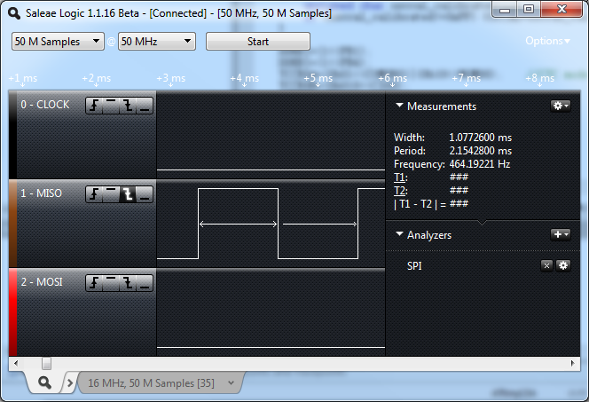
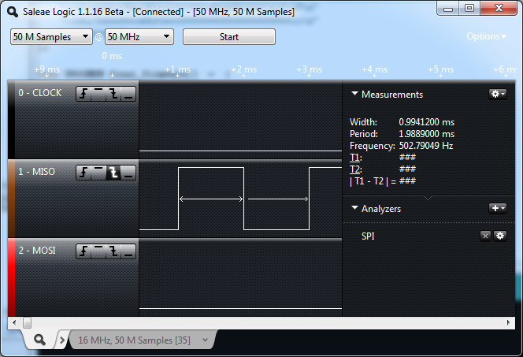

# AVR standalone ISP

This is a offline avr programmer based on Adafruit's one, using an Arduino (or Arduino based board). 
I created my repo to add more features.

## Feature: Calibration of the internal RC oscillator

The accuracy of the factory calibration is within +/-3 or +/-10% (refer to the datasheet). And it will drift with temperature and voltage. it is possible to perform a secondary calibration of the RC oscillator. By doing this it is possible to obtain a frequency accuracy within +/-1 (+/-2% for those with an 10% accuracy from factory calibration). A secondary calibration can thus be performed to improve or tailor the accuracy or frequency of the oscillator.

There are two ways to perform a calibration. Runtime or in production. Runtime one needs an accurate external reference. It can be UART (AVR054), external 32kHz XTAL (AVR055) or usb framelength (VUSB on attiny45/85). 

If the circuit don't have a external reference, or ROM space is limited. We can use a similar voltage and temperature to working environment, and write calibrated value of OSCCAL into flash. So code only need to fetch it from flash and put it into OSCCAL and we get 1% accuracy. 

I implemented AVR053 protocol into this project. The idea is to write a calibration firmware into chip. Then programmer feeds an accurate frequency around 32Khz to chip and let chip calibrate itself and put that OSCCAL value into EEPROM. Programmer reads it back, flashes new firmware with the OSCCAL value read from EEPROM. So the chip can fetch the best OSCCAL value in code.

All official programmer supports this calibration protocol. (AVR053 don't has Avr Dragon file so we need to copy one from the other programmers, I change the frequency to 32572). But I haven't found an offline programmer supports this protocol. So I did this on Arduino.

This project uses an AtTiny13A as an example.

It will fetch OSCCAL in flash if it is not 0xFF (unprogrammed). Then it output a 500Hz signal on MISO and an 1Hz signal on PB4. Which can be an accurate second signal we can see.

If the firmware is programmed directly, it is around 8% error.

After calibration it became 1%. Which can be done by this Arduino sketch.

